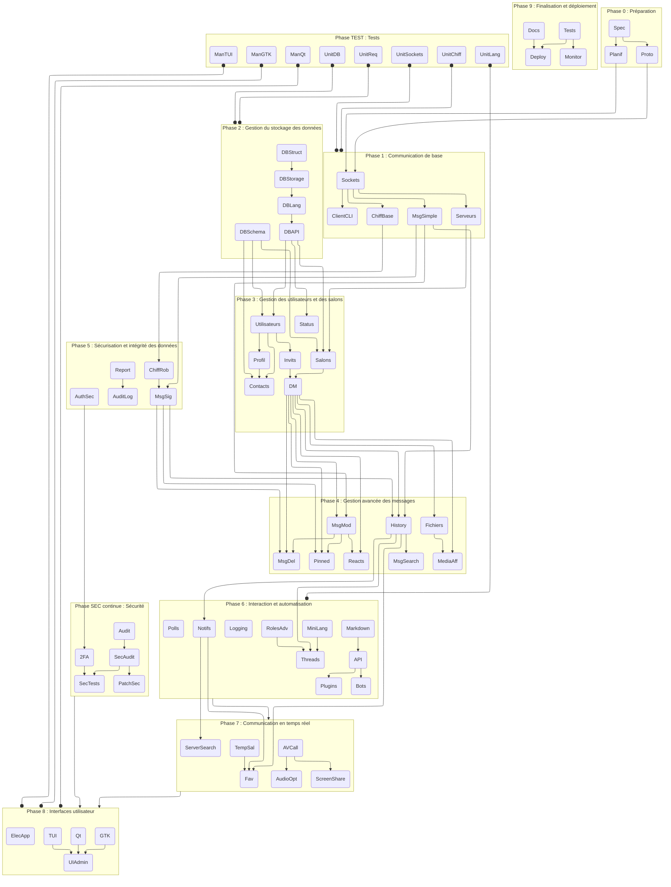

# Plan de développement

## Spécifications

### Tests

On essayera de suivre les principes du TDD (Test-Driven Development) pour garantir la qualité du code et la fiabilité de l'application. Des tests unitaires et manuels seront réalisés en parallèle des phases qui le nécessitent.

### Langage

Le langage de programmation choisi est le C pour sa rapidité d'exécution et sa portabilité. Il permettra de développer un serveur et un client multi-plateformes.

Nous développons un système de gestion base de données en OCaml, simple, minimal et sans fonctionnalités superflues.

### Architecture

ECB (Entity-Control-Boundary) semble être une architecture adaptée à notre projet. Elle permet de séparer les différentes parties de l'application de manière claire et efficace tout en permettant une portabilité et une évolutivité du code.

### Interface

L'interface utilisateur sera développée en GTK pour Linux et en Qt pour Windows. Une interface en TUI (Text User Interface) pourra être développée en option. Une electron-app pourrait être envisagée pour une version web et une version mobile.

### Protocole

Le protocole de communication sera basé sur des sockets TCP/IP. Il devra être sécurisé par un chiffrement robuste (RSA, Diffie-Hellman) et une authentification sécurisée (multi-facteurs, tokens).

## Liste des tâches

| Nom          | Libellé                                                                                             | Responsable |
|--------------|-----------------------------------------------------------------------------------------------------|-------------|
|              | **Phase 0 : Préparation**                                                                           | [Manolo-dev](https://github.com/Manolo-dev) |
| Spec         | Analyse des spécifications et conception de l'architecture (ECB)                                    |             |
| Proto        | Définition du protocole de communication (formats, commandes, sécurité, échanges de clés)           |             |
| Planif       | Planification et répartition des tâches / choix des technologies (GTK, Qt, TUI)                     |             |
|              | **Phase 1 : Communication de base**                                                                 | [Rhexephon](https://github.com/Rhexephon)   |
| Sockets      | Mise en place de la gestion des sockets (client/server)                                             |             |
| ChiffBase    | Intégration d'un chiffrement de base (RSA, certificats auto-signés)                                 |             |
| ClientCLI    | Développement d’un client en ligne de commande pour tests et débogage                               |             |
| MsgSimple    | Implémentation d’une gestion simple des messages (envoi/réception)                                  |             |
| Serveurs     | Création et gestion de serveurs                                                                     |             |
|              | **Phase 2 : Gestion du stockage des données**                                                       | [Manolo-dev](https://github.com/Manolo-dev) |
| DBStruct     | Choix et mise en place de la structure de stockage (arbre B, skiplist, autre)                       |             |
| DBStorage    | Stockage et récupération des données en mémoire et sur disque                                       |             |
| DBLang       | Création d’un langage de requêtes pour interagir avec la base de données                            |             |
| DBAPI        | Définition de l’API pour interagir avec la base de données                                          |             |
| DBSchema     | Création des schémas de base de données (utilisateurs, messages, salons, messages)                  |             |
|              | **Phase 3 : Gestion des utilisateurs et des salons**                                                | [Skylord65](https://github.com/Skylord65)   |
| Utilisateurs | Gestion des utilisateurs (inscription, création de compte, connexion, rôles)                        |             |
| Salons       | Gestion et catégorisation des salons (textuels, vocaux, vidéos)                                     |             |
| Contacts     | Gestion des connaissances (ajout, suppression, blocage, statuts : amis, collègue, etc.)             |             |
| Status       | Statuts personnalisés (en ligne, occupé, invisible, etc.)                                           |             |
| Profil       | Profil utilisateur avec avatar (pdp simple) et bio                                                  |             |
| Invits       | Gestion des invitations et des liens d’invitation                                                   |             |
| DM           | Messages privés                                                                                     |             |
|              | **Phase 4 : Gestion avancée des messages**                                                          | [Rhexephon](https://github.com/Rhexephon)   |
| MsgMod       | Envoi et modification de messages                                                                   |             |
| MsgDel       | Suppression de messages (pour soi ou pour tous)                                                     |             |
| Reacts       | Réactions aux messages avec emojis                                                                  |             |
| Pinned       | Messages épinglés                                                                                   |             |
| Fichiers     | Envoi de fichiers et images                                                                         |             |
| MediaAff     | Lecture et affichage des vidéos, GIFs et images intégrées                                           |             |
| History      | Historique des messages et notifications                                                            |             |
| MsgSearch    | Recherche de messages (avancée, éventuellement regex)                                               |             |
|              | **Phase 5 : Sécurisation et intégrité des données**                                                 | [Rhexephon](https://github.com/Rhexephon)   |
| ChiffRob     | Mise en place d’un chiffrement robuste (RSA, Diffie-Hellman)                                        |             |
| AuthSec      | Sécurisation de l’authentification (multi-facteurs, tokens)                                         |             |
| MsgSig       | Validation de l’intégrité des messages (signatures numériques)                                      |             |
| Report       | Signalement d’utilisateurs ou de messages                                                           |             |
| AuditLog     | Journaux d’audit pour les serveurs                                                                  |             |
|              | **Phase 6 : Interaction et automatisation**                                                         | [Manolo-dev](https://github.com/Manolo-dev) |
| MiniLang     | Développement d’un mini-langage de commandes (admin & modération, intégrant le système de mentions) |             |
| Markdown     | Implémentation d’un compilateur markdown pour affichage enrichi                                     |             |
| Notifs       | Gestion des notifications (messages, mentions, alertes)                                             |             |
| Logging      | Système de logging et débogage                                                                      |             |
| RolesAdv     | Gestion des rôles et permissions avancées                                                           |             |
| Threads      | Citations et fils de discussion (threads)                                                           |             |
| Polls        | Sondages et formulaires via bots                                                                    |             |
| API          | API                                                                                                 |             |
| Bots         | Bots et automatisation                                                                              |             |
| Plugins      | Plugins et intégrations tierces (YouTube, Twitch, Spotify, etc.)                                    |             |
|              | **Phase 7 : Communication en temps réel**                                                           | [Skylord65](https://github.com/Skylord65)   |
| AVCall       | Appels vocaux et vidéo en groupe                                                                    |             |
| ScreenShare  | Partage d’écran                                                                                     |             |
| AudioOpt     | Suppression du bruit et réglage du gain automatique                                                 |             |
| TempSal      | Salons temporaires                                                                                  |             |
| ServerSearch | Recherche de serveurs publics                                                                       |             |
| Fav          | Système de favoris ou raccourcis vers des messages/serveurs                                         |             |
|              | **Phase 8 : Interfaces utilisateur**                                                                | [Manolo-dev](https://github.com/Manolo-dev) |
| GTK          | Conception de l’interface graphique avec GTK                                                        |             |
| Qt           | Portage/adaptation pour Qt (Windows)                                                                |             |
| TUI          | Développement d’une interface en TUI (optionnelle)                                                  |             |
| UIAdmin      | Intégration des contrôles d’administration et modération                                            |             |
| ElecApp      | Electron-app pour une version web et mobile                                                         |             |
|              | **Phase 9 : Finalisation et déploiement**                                                           | [Skylord65](https://github.com/Skylord65)   |
| Tests        | Mise en place des tests unitaires et d’intégration                                                  |             |
| Docs         | Rédaction de la documentation technique et utilisateur                                              |             |
| Deploy       | Déploiement du serveur central et configuration                                                     |             |
| Monitor      | Système de monitoring et d’alertes                                                                  |             |
|              | **Phase SEC continue : Sécurité**                                                                   | [Skylord65](https://github.com/Skylord65)   |
| Audit        | Audit de sécurité initial & revue des meilleures pratiques (open source)                            |             |
| SecAudit     | Audit de sécurité continu et revue du code                                                          |             |
| PatchSec     | Système de gestion et déploiement des mises à jour de sécurité                                      |             |
| 2FA          | Authentification à deux facteurs (2FA)                                                              |             |
| SecTests     | Tests de sécurité approfondis (pentests, vulnérabilités)                                            |             |
|              | **Phase TEST : Tests**                                                                              |             |
| UnitSockets  | Tests unitaires pour la gestion des sockets                                                         |             |
| UnitChiff    | Tests unitaires pour le chiffrement                                                                 |             |
| UnitDB       | Tests unitaires pour la base de données                                                             |             |
| UnitReq      | Tests unitaires pour les requêtes                                                                   |             |
| UnitLang     | Tests unitaires pour le mini-langage                                                                |             |
| ManGTK       | Tests manuels de l’interface GTK                                                                    |             |
| ManQt        | Tests manuels de l’interface Qt                                                                     |             |
| ManTUI       | Tests manuels de l'interface TUI                                                                    |             |


### Dépendances des tâches


## Contributeurs responsables

## Format des identifiants

### Nommage des fichiers

Le nom des fichiers `.c` doit être en `snake_case.c`.
Le nom des fichiers `.h` doit être en `snake_case.h`.
Le nom des fichiers `.sh` doit être en `snake_case.sh`.
Le nom des fichiers `.ml` doit être en `snake_case.ml`.
Le nom des fichiers `.md` doit être en `UPPER_SNAKE_CASE.md`.
Le nomes des fonctions doit être en `snake_case`.
Le nom des variables doit être en `snake_case`.
Le nom des constantes doit être en `UPPER_SNAKE_CASE`.
Le nom des structures doit être en `PascalCase_s`.
Le nom des énumérations doit être en `PascalCase_e`.
Le nom des structures pointées doit être en `PascalCase_t` (nouveau type, typedef, faire très attention à ne pas générer de conflit avec un type POSIX).
Les includes guards doivent être en `__UPPER_SNAKE_CASE_H__` (ex: `#ifndef __MY_HEADER_H__`) et leurs `endif` doivent indiquer le fichier source correspondant (ex: `#endif // __MY_HEADER_H__`).

## Documentation

Tous les fichiers, toutes les fonctions, struct, define (sauf pour les include guards), enum et variables globales (etc) du projet devront être documentées selon le format Doxygen suivant :

```
<doxygen_doc> ::= "/**" <EOL> <docs> "**/"

<docs> ::=
    | <doc_line> <EOL> <docs>
    | <doc_line> <EOL>

<doc_line> ::= "*" <doc_element>

<doc_element> ::=
    | "\\brief " <text>
    | "\\param" <param_dir> " " <param_name> " " <text>
    | "\\return " <text>
    | "\\pre " <text>
    | "\\post " <text>
    | "\\file " <filename>
    | "\\struct" <text>
    | "\\enum" <text>
    | "\\def" <text>
    | "\\note " <text>
    | "\\warning " <text>
    | "\\example " <ex_code>
    | "\\todo " <text>
    | "\\deprecated " <text>
    | "\\see " <ref>
    | "\\author " <text>
    | "\\date " <date_value>
    | "\\version " <version_num>
    | "\\details " <text>
    | "\\exception " <ex_name> " " <text>
    | "\\sa " <ref>

<filename>   ::= r"[^\s\/]+(\.[a-zA-Z0-9]+)?"

<text>       ::= r"[^\n]+"

<date_value> ::= r"\d{2}/\d{2}/\d{4}" # JJ/MM/AAAA

<version_num>::= r"\d+\.\d+\.\d+(\.\d+)*" # Exige major.minor.patch[.chore]

<param_name> ::= r"[a-zA-Z_][a-zA-Z0-9_]*"

<ex_code>    ::= r".*(\n\s*\*.*)*"

<ref>        ::= r"[\w:]+(\(\))?(,\s*[\w:]+(\(\))?)*"

<ex_name>    ::= r"[A-Z]\w+"

<param_dir>  ::=
  | "[in]"
  | "[out]"
  | "[in,out]"
```

### Structure obligatoire

- `\brief` : Résumé concis de la fonction (2-3 lignes max)
- `\param[in/out]` : Description des paramètres d'entrée/sortie
- `\return` : Explication précise de la valeur de retour
- `\pre` : Conditions nécessaires avant l'appel
- `\post` :  Conditions nécessaires après l'appel

### Éléments optionnels

- `\file` : Nom du fichier documenté
- `\struct` : Description d'une structure de données
- `\enum` : Description d'une énumération
- `\def` : Description d'une définition
- `\note` : Informations complémentaires (choix techniques, limites)
- `\warning` : Alertes critiques (allocations mémoire, effets de bord)
- `\example` : Snippet d'utilisation réaliste avec sortie attendue
- `\todo` : Liste des améliorations planifiées
- `\deprecated` : Indication de fonctions à remplacer
- `\see` : Références croisées (autres fonctions/fichiers)
- `\author` : Auteur(s) principal(aux) de la fonction/fichier
- `\date` : Date de création/modification (format JJ/MM/AAAA)
- `\version` : Version associée à la fonctionnalité (suivant SemVer)
- `\details` : Explications techniques approfondies (implémentation, algorithmes)
- `\exception` : Comportements exceptionnels (erreurs non couvertes par le return)
- `\sa` : "Voir aussi" (alias de `\see` pour les références croisées)

### Bonnes pratiques

- Documentation en français
- Liens vers les spécifications techniques (RFC, schémas)
- Cohérence entre `\pre/\post` et les assertions du code
- Mise à jour synchrone avec les modifications de code

### Exemples

```c
/**
 * \author Manolo-dev
 * \date 15/04/2024
 * \version 1.2
 * \brief Initialise une connexion socket sécurisée
 * \param[in] hostname Nom du serveur (format FQDN)
 * \param[in] port Port TCP (1024-65535)
 * \param[out] ssl_ctx Contexte SSL initialisé
 * \return 0 si succès, -1 pour erreur système, -2 pour erreur SSL
 * \note Nécessite OpenSSL 3.0+ et une pile TCP/IP fonctionnelle
 * \warning Ne pas oublier de libérer le contexte SSL avec SSL_CTX_free()
 * \pre hostname doit être résoluble via DNS
 * \post Le socket est bindé et en état LISTEN
 * \example
 * SSL_CTX *ctx;
 * if(init_ssl_socket("example.com", 443, &ctx) == 0) {
 *   printf("Connexion établie !\n");
 * }
 * \todo Ajouter support TLS 1.3
 * \see SSL_CTX_new(), socket()
 * \deprecated Remplacée par init_quic_connection() dans v2.0
**/
int init_ssl_socket(const char* hostname, int port, SSL_CTX** ssl_ctx);
```

```c
/**
 * \struct serverConfig_s
 * \brief Configuration globale du serveur
 * \details Stocke les paramètres réseau et sécurité du serveur.
 *          Persistée dans un fichier JSON via save_config().
 * \note La structure doit être initialisée avec init_server_config()
 * \warning Modification nécessitant un redémarrage du serveur
 * \example
 * struct server_config cfg = {
 *     .max_connections = 1000,
 *     .ssl_enabled = 1,
 *     .timeout = 300
 * };
**/
struct serverConfig_s {
    int max_connections;
    int ssl_enabled;
    int timeout;
};
```

```c
/**
 * \struct serverStats_s
 * \brief Statistiques temps-réel du serveur
**/
struct serverStats_s {
    /**
     * \brief Requêtes traitées (lues depuis le dernier reboot)
     * \note Compteur 64 bits atomique
     * \warning Ne pas modifier directement
     */
    _Atomic uint64_t total_requests;
    /**
     * \brief Latence moyenne en microsecondes
     * \details Calculée sur une fenêtre glissante de 60s
     */
    double avg_latency;
};
```

```c
/**
 * \enum connectionState_e
 * \brief État de la connexion
 * \details Utilisé pour suivre l'état de chaque connexion
 * \note Les états sont définis dans le fichier config.h
 * \warning Ne pas modifier les valeurs directement
 * \sa connection_pool
**/
enum connectionState_e {
    DISCONNECTED = 0, /**< Non connecté */
    CONNECTING,       /**< En cours de connexion */
    CONNECTED,        /**< Connecté */
    DISCONNECTING     /**< En cours de déconnexion */
};
```

```c
/**
 * \file connection_pool.h
 * \brief Gestion des connexions actives
 * \details Permet de suivre les connexions actives et leur état.
 * \author Rhexephon
 * \date 15/04/2024
 * \version 1.0
 * \warning Ne pas accéder directement au tableau sans verrou
 * \note Utilise un mutex pour éviter les accès concurrents
**/
```

```c
/**
 * \brief Pool de connexions actives
 * \details Tableau dynamique géré par pthread pour les connexions concurrentes.
 * \warning Accès concurrentiel - utiliser mutex_lock() avant modification
 * \note Taille maximale définie par MAX_POOL_SIZE dans config.h
 * \sa add_connection(), remove_connection()
**/
extern pthread_t connection_pool[MAX_POOL_SIZE];
```

```c
/**
 * \def MAX_PAYLOAD
 * \brief Taille max des pajets réseau (octets)
 * \warning Ne pas dépasser 65535 @see RFC 793
 */
#define MAX_PAYLOAD 65535
```

## Format des commits

### Grammaire BNF

```
<commit> ::= ["!"] <type> "(" <target> [":" <specifier>] ")" [":" <description>] [";" <commit>]

<type_error> ::=
  | "compilation"
  | "runtime"
  | "segfault"
  | "memory"
  | "undefined"
  | "error"
  | "warning"
  | "assert"
  | "exception"
  | "panic"

<type> ::=
  | "add"
  | "fix"
  | "refactor"
  | "docs"
  | "test"
  | "style"
  | "perf"
  | "chore"
  | <type_error>

<target> ::=
  | <file>
  | <feature>
  | <directory>

<file> ::= r"[^/\0]+"

<directory> ::= r"[^/\0]+(/[^/\0]+)*/"

<feature> ::= <identifier>

<specifier> ::=
  | <line_number>
  | <function_name>

<line_number> ::= r"[1-9][0-9]*"

<function_name> ::= <identifier>

<identifier> ::= r"[a-zA-Z_][a-zA-Z0-9_]*"

<description> ::= r"[^;]+"
```

### Explication des éléments

- **`!`** *(optionnel)* : Indique que le code ne compile pas ou produit une erreur. Si l'erreur est connue, elle peut être précisée comme un élément de type `type_error`.
- **`type_error`** *(optionnel)* : Indique le type d'erreur rencontrée.
  - `compilation` : Erreur de compilation.
  - `runtime` : Erreur d'exécution.
  - `segfault` : Erreur de segmentation.
  - `memory` : Problème de mémoire.
  - `undefined` : Comportement indéfini.
  - `error` : Autre erreur.
  - `warning` : Avertissement.
  - `assert` : Échec d'une assertion.
  - `exception` : Exception levée.
  - `panic` : État critique du programme.
- **`<type>`** : Indique la nature de la modification.
  - `add` : Ajout de code ou de fichiers.
  - `fix` : Correction de bug.
  - `refactor` : Réorganisation du code sans changement fonctionnel.
  - `docs` : Ajout ou modification de documentation.
  - `test` : Ajout ou modification de tests.
  - `style` : Changement de formatage sans impact sur le code.
  - `perf` : Amélioration des performances.
  - `chore` : Maintenance du projet sans impact direct sur le code.
- **`<target>`** : Spécifie le fichier ou la fonctionnalité concernée.
- **`<specifier>`** *(optionnel)* : Précise une ligne ou une fonction ciblée.
- **`<description>`** *(optionnel)* : Fournit un message explicatif.
- **Les commits multiples** peuvent être séparés par `; `.

### Exemples

- **Ajout d'un fichier de documentation**
  ```sh
  git commit -m "add(README.md) : Ajout du fichier README"
  ```

- **Correction d'un bug sur une ligne spécifique**
  ```sh
  git commit -m "fix(main.c:42) : Correction du segfault ligne 42"
  ```

- **Ajout d'une nouvelle fonction**
  ```sh
  git commit -m "add(utils.c:parse_input) : Ajout de la fonction parse_input"
  ```

- **Refactorisation d'une fonction**
  ```sh
  git commit -m "refactor(server.c:handle_request) : Simplification de la logique"
  ```

- **Modification du style (indentation, espaces, etc.)**
  ```sh
  git commit -m "style(config.py) : Correction des indentations"
  ```

- **Amélioration des performances d'une boucle**
  ```sh
  git commit -m "perf(matrix.c:multiply) : Optimisation de la multiplication des matrices"
  ```

- **Ajout de tests unitaires**
  ```sh
  git commit -m "test(math_utils.c) : Ajout des tests pour les fonctions mathématiques"
  ```

- **Modification de plusieurs fichiers dans un seul commit**
  ```sh
  git commit -m "add(server.c:init_server) : Ajout de la fonction init_server; fix(client.c:connect) : Correction de la gestion des erreurs"
  ```

- **Ajout d'une nouvelle fonctionnalité produisant une erreur**
  ```sh
  git commit -m "!add(auth.c:login) : Ajout de la fonction de connexion; error(auth.c:login) : Erreur de segmentation lors de la connexion"
  ```

- **Ajout d'une nouvelle fonctionnalité avec un avertissement**
  ```sh
  git commit -m "add(auth.c:login) : Ajout de la fonction de connexion; warning(auth.c:login) : Avertissement sur l'utilisation de variables non initialisées"
  ```

- **Modification d'une fonctionalité avec une erreur inconnue (ou obvieuse)**
  ```sh
  git commit -m "!fix(auth.c:login) : Correction de la fonction de connexion"
  ```
