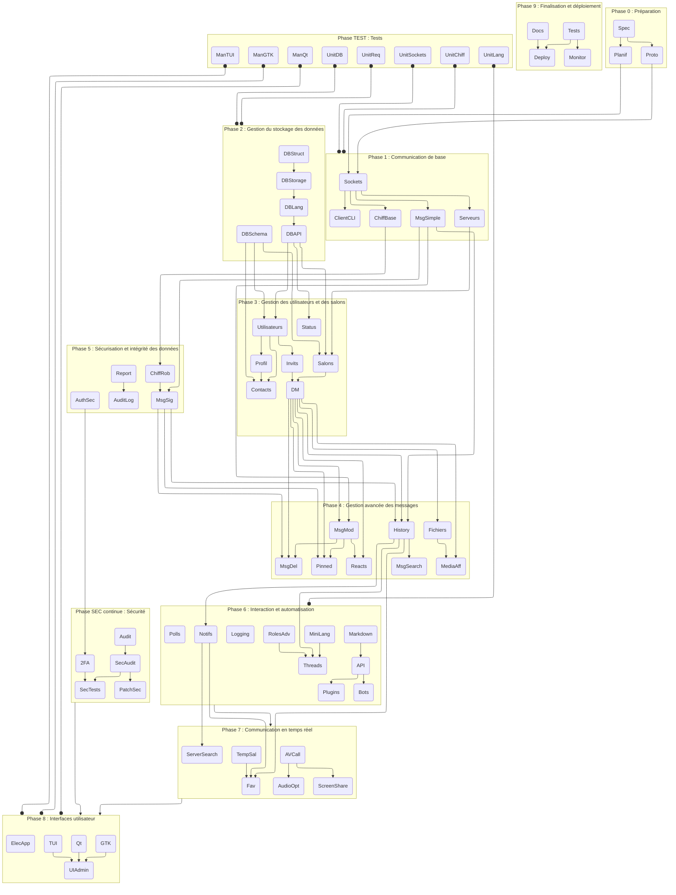

# Plan de développement

## Specifications

### Langage

Le langage de programmation choisi est le C pour sa rapidité d'exécution et sa portabilité. Il permettra de développer un serveur et un client multi-plateformes.

### Architecture

ECB (Entity-Control-Boundary) semble être une architecture adaptée à notre projet. Elle permet de séparer les différentes parties de l'application de manière claire et efficace tout en permettant une portabilité et une évolutivité du code.

### Interface

L'interface utilisateur sera développée en GTK pour Linux et en Qt pour Windows. Une interface en TUI (Text User Interface) pourra être développée en option. Une electron-app pourrait être envisagée pour une version web et une version mobile.

### Protocole

Le protocole de communication sera basé sur des sockets TCP/IP. Il devra être sécurisé par un chiffrement robuste (RSA, Diffie-Hellman) et une authentification sécurisée (multi-facteurs, tokens).

## Liste des tâches

| Nom          | Libellé                                                                                             | Responsable |
|--------------|-----------------------------------------------------------------------------------------------------|-------------|
|              | **Phase 0 : Préparation**                                                                           | [Manolo-dev](https://github.com/Manolo-dev) |
| Spec         | Analyse des spécifications et conception de l'architecture (ECB)                                    |             |
| Proto        | Définition du protocole de communication (formats, commandes, sécurité, échanges de clés)           |             |
| Planif       | Planification et répartition des tâches / choix des technologies (GTK, Qt, TUI)                     |             |
|              | **Phase 1 : Communication de base**                                                                 | [Rhexephon](https://github.com/Rhexephon)   |
| Sockets      | Mise en place de la gestion des sockets (client/server)                                             |             |
| ChiffBase    | Intégration d'un chiffrement de base (RSA, certificats auto-signés)                                 |             |
| ClientCLI    | Développement d’un client en ligne de commande pour tests et débogage                               |             |
| MsgSimple    | Implémentation d’une gestion simple des messages (envoi/réception)                                  |             |
| Serveurs     | Création et gestion de serveurs                                                                     |             |
|              | **Phase 2 : Gestion du stockage des données**                                                       | [Manolo-dev](https://github.com/Manolo-dev) |
| DBStruct     | Choix et mise en place de la structure de stockage (arbre B, skiplist, autre)                       |             |
| DBStorage    | Stockage et récupération des données en mémoire et sur disque                                       |             |
| DBLang       | Création d’un langage de requêtes pour interagir avec la base de données                            |             |
| DBAPI        | Définition de l’API pour interagir avec la base de données                                          |             |
| DBSchema     | Création des schémas de base de données (utilisateurs, messages, salons, messages)                  |             |
|              | **Phase 3 : Gestion des utilisateurs et des salons**                                                | [Skylord65](https://github.com/Skylord65)   |
| Utilisateurs | Gestion des utilisateurs (inscription, création de compte, connexion, rôles)                        |             |
| Salons       | Gestion et catégorisation des salons (textuels, vocaux, vidéos)                                     |             |
| Contacts     | Gestion des connaissances (ajout, suppression, blocage, statuts : amis, collègue, etc.)             |             |
| Status       | Statuts personnalisés (en ligne, occupé, invisible, etc.)                                           |             |
| Profil       | Profil utilisateur avec avatar (pdp simple) et bio                                                  |             |
| Invits       | Gestion des invitations et des liens d’invitation                                                   |             |
| DM           | Messages privés                                                                                     |             |
|              | **Phase 4 : Gestion avancée des messages**                                                          | [Rhexephon](https://github.com/Rhexephon)   |
| MsgMod       | Envoi et modification de messages                                                                   |             |
| MsgDel       | Suppression de messages (pour soi ou pour tous)                                                     |             |
| Reacts       | Réactions aux messages avec emojis                                                                  |             |
| Pinned       | Messages épinglés                                                                                   |             |
| Fichiers     | Envoi de fichiers et images                                                                         |             |
| MediaAff     | Lecture et affichage des vidéos, GIFs et images intégrées                                           |             |
| History      | Historique des messages et notifications                                                            |             |
| MsgSearch    | Recherche de messages (avancée, éventuellement regex)                                               |             |
|              | **Phase 5 : Sécurisation et intégrité des données**                                                 | [Rhexephon](https://github.com/Rhexephon)   |
| ChiffRob     | Mise en place d’un chiffrement robuste (RSA, Diffie-Hellman)                                        |             |
| AuthSec      | Sécurisation de l’authentification (multi-facteurs, tokens)                                         |             |
| MsgSig       | Validation de l’intégrité des messages (signatures numériques)                                      |             |
| Report       | Signalement d’utilisateurs ou de messages                                                           |             |
| AuditLog     | Journaux d’audit pour les serveurs                                                                  |             |
|              | **Phase 6 : Interaction et automatisation**                                                         | [Manolo-dev](https://github.com/Manolo-dev) |
| MiniLang     | Développement d’un mini-langage de commandes (admin & modération, intégrant le système de mentions) |             |
| Markdown     | Implémentation d’un compilateur markdown pour affichage enrichi                                     |             |
| Notifs       | Gestion des notifications (messages, mentions, alertes)                                             |             |
| Logging      | Système de logging et débogage                                                                      |             |
| RolesAdv     | Gestion des rôles et permissions avancées                                                           |             |
| Threads      | Citations et fils de discussion (threads)                                                           |             |
| Polls        | Sondages et formulaires via bots                                                                    |             |
| API          | API                                                                                                 |             |
| Bots         | Bots et automatisation                                                                              |             |
| Plugins      | Plugins et intégrations tierces (YouTube, Twitch, Spotify, etc.)                                    |             |
|              | **Phase 7 : Communication en temps réel**                                                           | [Skylord65](https://github.com/Skylord65)   |
| AVCall       | Appels vocaux et vidéo en groupe                                                                    |             |
| ScreenShare  | Partage d’écran                                                                                     |             |
| AudioOpt     | Suppression du bruit et réglage du gain automatique                                                 |             |
| TempSal      | Salons temporaires                                                                                  |             |
| ServerSearch | Recherche de serveurs publics                                                                       |             |
| Fav          | Système de favoris ou raccourcis vers des messages/serveurs                                         |             |
|              | **Phase 8 : Interfaces utilisateur**                                                                | [Manolo-dev](https://github.com/Manolo-dev) |
| GTK          | Conception de l’interface graphique avec GTK                                                        |             |
| Qt           | Portage/adaptation pour Qt (Windows)                                                                |             |
| TUI          | Développement d’une interface en TUI (optionnelle)                                                  |             |
| UIAdmin      | Intégration des contrôles d’administration et modération                                            |             |
| ElecApp      | Electron-app pour une version web et mobile                                                         |             |
|              | **Phase 9 : Finalisation et déploiement**                                                           | [Skylord65](https://github.com/Skylord65)   |
| Tests        | Mise en place des tests unitaires et d’intégration                                                  |             |
| Docs         | Rédaction de la documentation technique et utilisateur                                              |             |
| Deploy       | Déploiement du serveur central et configuration                                                     |             |
| Monitor      | Système de monitoring et d’alertes                                                                  |             |
|              | **Phase SEC continue : Sécurité**                                                                   | [Skylord65](https://github.com/Skylord65)   |
| Audit        | Audit de sécurité initial & revue des meilleures pratiques (open source)                            |             |
| SecAudit     | Audit de sécurité continu et revue du code                                                          |             |
| PatchSec     | Système de gestion et déploiement des mises à jour de sécurité                                      |             |
| 2FA          | Authentification à deux facteurs (2FA)                                                              |             |
| SecTests     | Tests de sécurité approfondis (pentests, vulnérabilités)                                            |             |
|              | **Phase TEST : Tests**                                                                              |             |
| UnitSockets  | Tests unitaires pour la gestion des sockets                                                         |             |
| UnitChiff    | Tests unitaires pour le chiffrement                                                                 |             |
| UnitDB       | Tests unitaires pour la base de données                                                             |             |
| UnitReq      | Tests unitaires pour les requêtes                                                                   |             |
| UnitLang     | Tests unitaires pour le mini-langage                                                                |             |
| ManGTK       | Tests manuels de l’interface GTK                                                                    |             |
| ManQt        | Tests manuels de l’interface Qt                                                                     |             |
| ManTUI       | Tests manuels de l'interface TUI                                                                    |             |


### Dépendances des tâches


## Contributeurs responsables

## Format des commits

### Grammaire BNF

```
<commit> ::= <type> "(" <target> [":" <specifier>] ")" [":" <description>] [";" <commit>]

<type> ::=
  | "add"
  | "fix"
  | "refactor"
  | "docs"
  | "test"
  | "style"
  | "perf"
  | "chore"

<target> ::=
  | <file>
  | <feature>

<file> ::= r"[^/\0]+"

<feature> ::= <identifier>

<specifier> ::=
  | <line_number>
  | <function_name>

<line_number> ::= r"[1-9][0-9]*"

<function_name> ::= <identifier>

<identifier> ::= r"[a-zA-Z_][a-zA-Z0-9_]*"

<description> ::= r"[^;]+"
```

### Explication des éléments

- **`<type>`** : Indique la nature de la modification.
  - `add` : Ajout de code ou de fichiers.
  - `fix` : Correction de bug.
  - `refactor` : Réorganisation du code sans changement fonctionnel.
  - `docs` : Ajout ou modification de documentation.
  - `test` : Ajout ou modification de tests.
  - `style` : Changement de formatage sans impact sur le code.
  - `perf` : Amélioration des performances.
  - `chore` : Maintenance du projet sans impact direct sur le code.

- **`<target>`** : Spécifie le fichier ou la fonctionnalité concernée.
- **`<specifier>`** *(optionnel)* : Précise une ligne ou une fonction ciblée.
- **`<description>`** *(optionnel)* : Fournit un message explicatif.
- **Les commits multiples** peuvent être séparés par `; `.

### Exemples

1. **Ajout d'un fichier de documentation**
  ```sh
  git commit -m "add(README.md) : Ajout du fichier README"
  ```

2. **Correction d'un bug sur une ligne spécifique**
  ```sh
  git commit -m "fix(main.c:42) : Correction du segfault ligne 42"
  ```

3. **Ajout d'une nouvelle fonction**
  ```sh
  git commit -m "add(utils.c:parse_input) : Ajout de la fonction parse_input"
  ```

4. **Refactorisation d'une fonction**
  ```sh
  git commit -m "refactor(server.c:handle_request) : Simplification de la logique"
  ```

5. **Modification du style (indentation, espaces, etc.)**
  ```sh
  git commit -m "style(config.py) : Correction des indentations"
  ```

6. **Amélioration des performances d'une boucle**
  ```sh
  git commit -m "perf(matrix.c:multiply) : Optimisation de la multiplication des matrices"
  ```

7. **Ajout de tests unitaires**
  ```sh
  git commit -m "test(math_utils.c) : Ajout des tests pour les fonctions mathématiques"
  ```

8. **Modification de plusieurs fichiers dans un seul commit**
  ```sh
  git commit -m "add(server.c:init_server) : Ajout de la fonction init_server; fix(client.c:connect) : Correction de la gestion des erreurs"
  ```