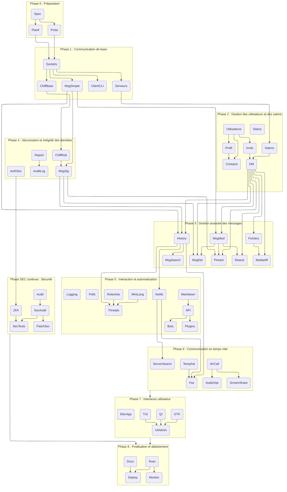

## Specifications

### Langage

Le langage de programmation choisi est le C pour sa rapidité d'exécution et sa portabilité. Il permettra de développer un serveur et un client multi-plateformes.

### Architecture

ECB (Entity-Control-Boundary) semble être une architecture adaptée à notre projet. Elle permet de séparer les différentes parties de l'application de manière claire et efficace tout en permettant une portable et une évolutivité du code.

### Interface

L'interface utilisateur sera développée en GTK pour Linux et en Qt pour Windows. Une interface en TUI (Text User Interface) pourra être développée en option. Une electron-app pourrait être envisagée pour une version web et une version mobile.

### Protocole

Le protocole de communication sera basé sur des sockets TCP/IP. Il devra être sécurisé par un chiffrement robuste (RSA, Diffie-Hellman) et une authentification sécurisée (multi-facteurs, tokens).

## Liste des tâches

| Nom          | Libellé                                                                                             |
|--------------|-----------------------------------------------------------------------------------------------------|
|              | **Phase 0 : Préparation**                                                                           |
| Spec         | Analyse des spécifications et conception de l'architecture (ECB)                                    |
| Proto        | Définition du protocole de communication (formats, commandes, sécurité, échanges de clés)           |
| Planif       | Planification et répartition des tâches / choix des technologies (GTK, Qt, TUI)                     |
|              | **Phase 1 : Communication de base**                                                                 |
| Sockets      | Mise en place de la gestion des sockets (client/server)                                             |
| ChiffBase    | Intégration d'un chiffrement de base (RSA, certificats auto-signés)                                 |
| ClientCLI    | Développement d’un client en ligne de commande pour tests et débogage                               |
| MsgSimple    | Implémentation d’une gestion simple des messages (envoi/réception)                                  |
| Serveurs     | Création et gestion de serveurs                                                                     |
|              | **Phase 2 : Gestion des utilisateurs et des salons**                                                |
| Utilisateurs | Gestion des utilisateurs (inscription, création de compte, connexion, rôles)                        |
| Salons       | Gestion et catégorisation des salons (textuels, vocaux, vidéos)                                     |
| Contacts     | Gestion des connaissances (ajout, suppression, blocage, statuts : amis, collègue, etc.)             |
| Status       | Statuts personnalisés (en ligne, occupé, invisible, etc.)                                           |
| Profil       | Profil utilisateur avec avatar (pdp simple) et bio                                                  |
| Invits       | Gestion des invitations et des liens d’invitation                                                   |
| DM           | Messages privés                                                                                     |
|              | **Phase 3 : Gestion avancée des messages**                                                          |
| MsgMod       | Envoi et modification de messages                                                                   |
| MsgDel       | Suppression de messages (pour soi ou pour tous)                                                     |
| Reacts       | Réactions aux messages avec emojis                                                                  |
| Pinned       | Messages épinglés                                                                                   |
| Fichiers     | Envoi de fichiers et images                                                                         |
| MediaAff     | Lecture et affichage des vidéos, GIFs et images intégrées                                           |
| History      | Historique des messages et notifications                                                            |
| MsgSearch    | Recherche de messages (avancée, éventuellement regex)                                               |
|              | **Phase 4 : Sécurisation et intégrité des données**                                                 |
| ChiffRob     | Mise en place d’un chiffrement robuste (RSA, Diffie-Hellman)                                        |
| AuthSec      | Sécurisation de l’authentification (multi-facteurs, tokens)                                         |
| MsgSig       | Validation de l’intégrité des messages (signatures numériques)                                      |
| Report       | Signalement d’utilisateurs ou de messages                                                           |
| AuditLog     | Journaux d’audit pour les serveurs                                                                  |
|              | **Phase 5 : Interaction et automatisation**                                                         |
| MiniLang     | Développement d’un mini-langage de commandes (admin & modération, intégrant le système de mentions) |
| Markdown     | Implémentation d’un compilateur markdown pour affichage enrichi                                     |
| Notifs       | Gestion des notifications (messages, mentions, alertes)                                             |
| Logging      | Système de logging et débogage                                                                      |
| RolesAdv     | Gestion des rôles et permissions avancées                                                           |
| Threads      | Citations et fils de discussion (threads)                                                           |
| Polls        | Sondages et formulaires via bots                                                                    |
| API          | API                                                                                                 |
| Bots         | Bots et automatisation                                                                              |
| Plugins      | Plugins et intégrations tierces (YouTube, Twitch, Spotify, etc.)                                    |
|              | **Phase 6 : Communication en temps réel**                                                           |
| AVCall       | Appels vocaux et vidéo en groupe                                                                    |
| ScreenShare  | Partage d’écran                                                                                     |
| AudioOpt     | Suppression du bruit et réglage du gain automatique                                                 |
| TempSal      | Salons temporaires                                                                                  |
| ServerSearch | Recherche de serveurs publics                                                                       |
| Fav          | Système de favoris ou raccourcis vers des messages/serveurs                                         |
|              | **Phase 7 : Interfaces utilisateur**                                                                |
| GTK          | Conception de l’interface graphique avec GTK                                                        |
| Qt           | Portage/adaptation pour Qt (Windows)                                                                |
| TUI          | Développement d’une interface en TUI (optionnelle)                                                  |
| UIAdmin      | Intégration des contrôles d’administration et modération                                            |
| ElecApp      | Electron-app pour une version web et mobile                                                         |
|              | **Phase 8 : Finalisation et déploiement**                                                           |
| Tests        | Mise en place des tests unitaires et d’intégration                                                  |
| Docs         | Rédaction de la documentation technique et utilisateur                                              |
| Deploy       | Déploiement du serveur central et configuration                                                     |
| Monitor      | Système de monitoring et d’alertes                                                                  |
|              | **Phase SEC continue : Sécurité**                                                                   |
| Audit        | Audit de sécurité initial & revue des meilleures pratiques (open source)                            |
| SecAudit     | Audit de sécurité continu et revue du code                                                          |
| PatchSec     | Système de gestion et déploiement des mises à jour de sécurité                                      |
| 2FA          | Authentification à deux facteurs (2FA)                                                              |
| SecTests     | Tests de sécurité approfondis (pentests, vulnérabilités)                                            |

### Dépendances des tâches

